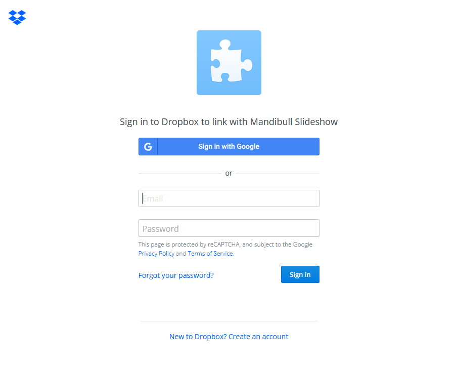
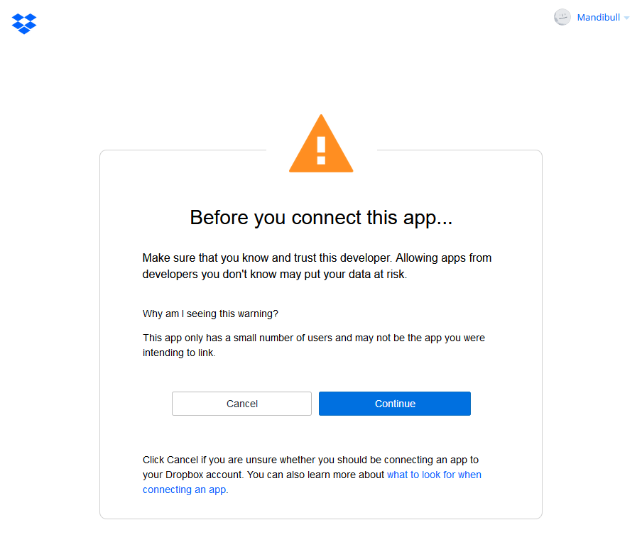
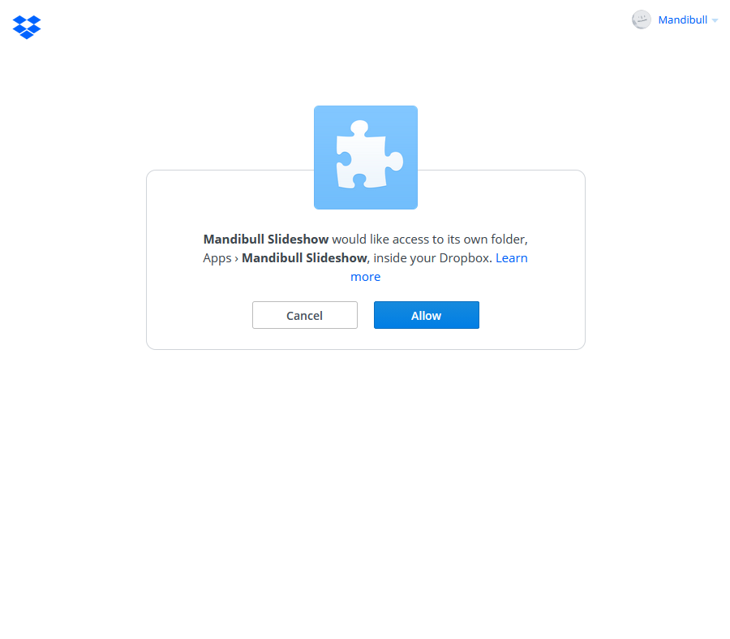
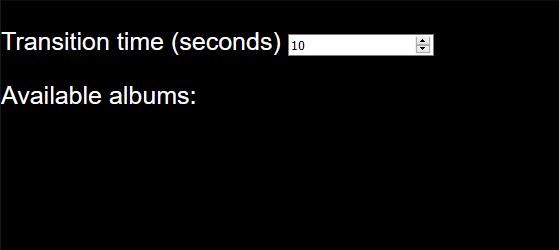
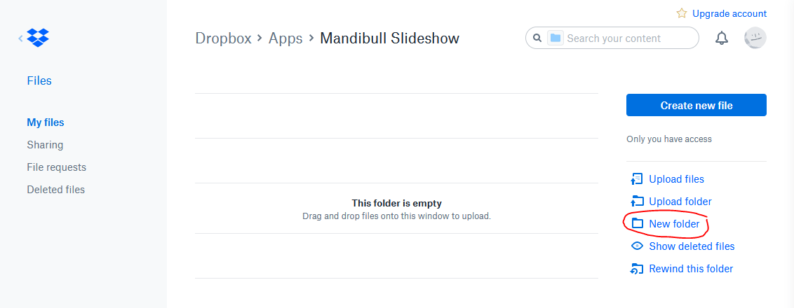
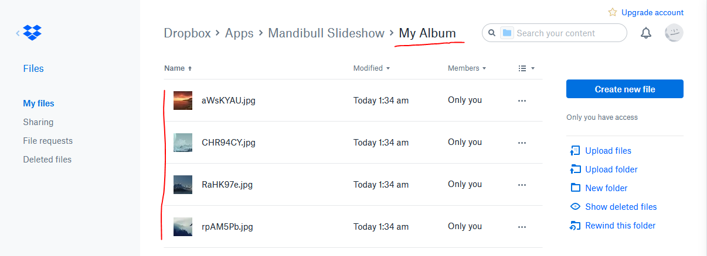
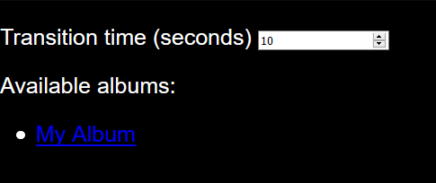
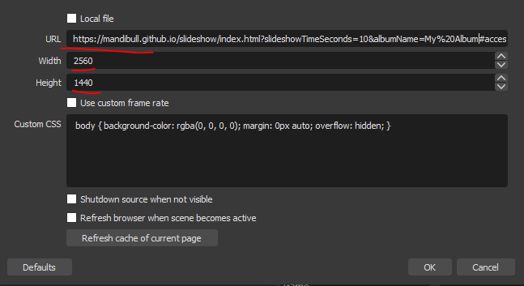

# Slideshow

Here's a mini-app to create a slideshow of images contained inside a Dropbox folder.

The main goal is to use the slideshow inside an OBS Browser Source.

## Initial setup

Visit: https://mandibull.github.io/slideshow/index.html. If you are not logged in to Dropbox you will be prompted to.

Next you shoud get a warning, please click "Continue".

The application will now ask to have it's own folder in your Dropbox account so you can put your photos in it.

If you are worried about privacy (and you should): the app will not be able to access whatever is in your Dropbox, only the folder dedicated to the app.

Click "Allow" if you understand.

If everything worked you should see this ugly page:

You are now ready to create your albums and upload your photos!

## Creating album(s) and uploading photos

Head into your Dropbox inside the app folder here https://www.dropbox.com/home/Apps/Mandibull%20Slideshow

Create one folder per slideshow by clicking "New folder".

Now go inside your folder(s) and upload your photos. It should look something like that:

## Creating the OBS Source

You now need to get an URL for the album you want. Head back to https://mandibull.github.io/slideshow/index.html and you should now see your albums listed:

Change the transition time to your preferred value and click on the album you want. If everything worked you should be on a page with your slideshow running. Copy the URL of this page.

Now head to OBS to your Browser Source properties and paste the URL in the "URL" field.
For best quality, make sure you change "Width" and "Height" to your screen resolution. Example values:
 - Most 24" monitors: width=1920 height=1080
 - Most 27" monitors: width=2560 height=1440

## Notes

- If you add or remove photos please restart OBS or click "Refresh cache of current page" in the source properties.
- The slidehow will only load 2 photos maximum, memory usage should be limited.
- The photo order is randomized every time you switch to the scene
